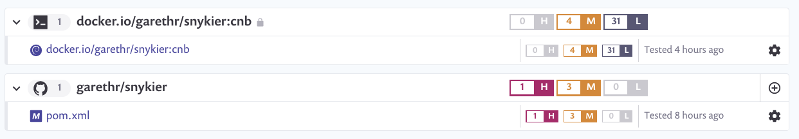

# Snykier

A simple vulnerable Java application used for demonstration purposes.

  

## Building container images with Jib and Buildpacks

This repository demonstrates two different ways of building container images

### Cloud Native Buildpacks

[Buildpacks](https://buildpacks.io/) are now integrated into the latest version of Sprint Boot, and can be used to automatically build images for the application.

```console
mvn spring-boot:build-image
```

You can quickly run the resulting image on Kubernetes like so:

```console
kubectl run snykier --image=garethr/snykier:cnb --port=8080 --restart=Never
```

### Jib

[Jib](https://github.com/GoogleContainerTools/jib) automatically builds and pushes an image, without requiing a local Docker dameon running.

```console
mvn compile jib:build
```

## Vulnerable?

The application, and the associated image, have a few known vulnerabilities. We can use Snyk to detect them. In this case we have the [Snyk Maven Plugin](https://github.com/snyk/snyk-maven-plugin) enabled, so running `mvn test` will also check for known vulnerabilities. We fail the build only when we detect a high severity vulnerability.

```xml
<plugin>
    <groupId>io.snyk</groupId>
    <artifactId>snyk-maven-plugin</artifactId>
    <version>1.2.5</version>
    <executions>
        <execution>
            <id>snyk-test</id>
            <phase>test</phase>
            <goals>
                <goal>test</goal>
            </goals>
        </execution>
    </executions>
    <configuration>
        <apiToken>${SNYK_TOKEN}</apiToken>
        <failOnSeverity>high</failOnSeverity>
        <org></org>
    </configuration>
</plugin>
```

We also test the Docker images using the [Snyk GitHub Actions](https://github.com/snyk/actions/tree/master/docker).


